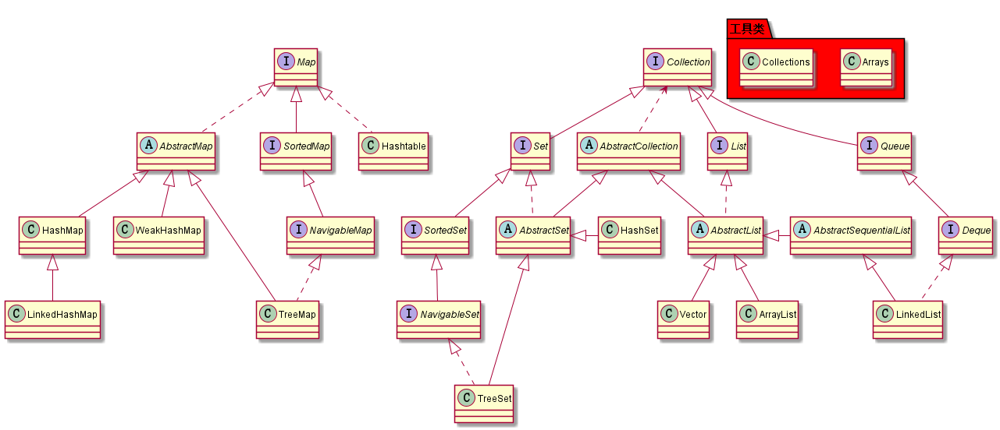

# Java集合-01概述
Java集合是java提供的工具包，位于java.util包下，包括Collection Map以及工具类Arrays，Collections

---

### 粗略分析

集合主要分为Collection和Map，在Collection又主要分为List和Set。
Collection中保存的元素都是同一种对象，
其中List中的元素为有序可重复，Set为无序不可重复，
Map保存键值对，格式为Map<K,V>，其中key不可重复，value没有这个要求
  
--- 
Arrays和Collections为工具类，简化集合的操作
