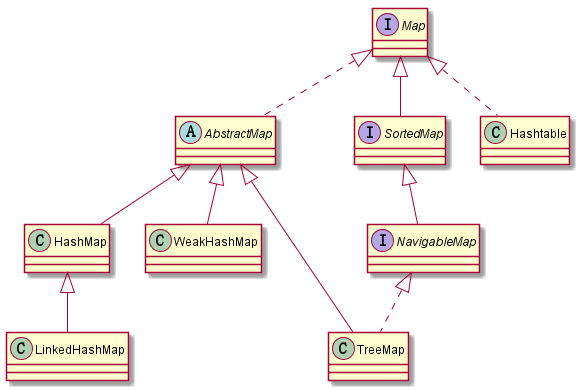

# Java集合-07Map接口及其抽象类

## 简介
> 前面把List基本记录完了，对于集合List，Map，Set，因为Set基于Map，故先记录Map。
这一篇主要记录Map接口及其抽象类(java version:1.8)

## 整体架构

参考上图,整体分析如下
1. Map
    >映射接口，定义了存储内容为键值对(key-value)及map的基本操作方法
2. AbstractMap
    >该抽象类对Map接口有了整体的实现，简化实现Map接口所需要的工作
3. SortedMap
    > 该接口更一步的对key提供了一个排序，该Map通过**Comparable**针对keys提供了一个自然排序，
    或者在创建时候通过**Comparator**实现排序
4. NavigableMap
    >在SortedMap接口上拓展了一系列的导航方法
5. HashMap
    >基于hash表实现，key和value都允许null，非同步的切不能保证排序
6. WeakHashMap
    > 和HashMap类似，不过它的键是"弱键"
7. LinkedHashMap
    > 基于hash表和链表实现，和HashMap不同的是它维护了一个双向链表
8. TreeMap
    > 基于红黑树实现，非同步，有序map
9. Hashtable
    >基于hash表，线程安全的,key不允许为null

## 深入分析接口和抽象类
### Map
>Map定义：public interface Map<K,V> 

>Map是一个键值对(key-value)映射接口，key不可重复，每个键至多映射一个值；
Map提供三个视图
>> 1. 键的Set集合视图
>>  2. 值得Collection集合视图
>>  3. 键值对的Set集合视图

#### Map部分源码
```java
public interface Map<K,V>{
    int size();//返回键值对个数
    boolean isEmpty();//判断是否为空
    boolean containKey(Object key);//判断是否包含key
    boolean containsValue(Object value);//判断是否包含value
    V get(Object key);//根据key获取value，如果实现类map允许null，对应的key没有映射，返回null
    V put(K key, V value);//添加键值对，如果原来map中包含key，返回值为旧值
    V remove(Object key);//移除键为key的键值对,如果没有返回null
    void putAll(Map<? extends K, ? extends V> m);//添加键值对
    void clear();//清空map
    Set<K> keySet();//key视图
    Collection<V> values();//value视图
    Set<Map.Entry<K, V>> entrySet();//键值对视图
    interface Entry<K,V>{//保存键值对
        K getKey();
        V getValue();
        V setValue(V value);
    }
    Set<Map.Entry<K, V>> entrySet();//键值对视图
    default V getOrDefault(Object key, V defaultValue) {//@since 1.8 返回键值对key对应的值，如果key没有返回defaultValue
            V v;
            return (((v = get(key)) != null) || containsKey(key))
                ? v
                : defaultValue;
    }
    default V putIfAbsent(K key, V value) {//如果键值对key对应的值为null，key对应的值变为value
            V v = get(key);
            if (v == null) {
                v = put(key, value);
            }
    
            return v;
    }
}
```

### AbstractMap
> 提供了Map接口的骨架实现，对于开发一个不可变的map，开发者只需要继承这个类且提供entrySet方法的实现，
通常entrySet方法返回的Set在AbstractSet上实现，该set不应该支持add()或者remove()方法，并且它的迭代器不支持remove()方法。
要开发一个可变的Map，开发者继承这个类提供entrySet方法的实现外还额外需要put方法，
不然会报UnsupportedOperationException(因为AbstractMap的put方法只是抛出了UnsupportedOperationException，如果你
想开发一个可变的Map，使用put方法是需要重写的)；并且entrySet().iterator()返回的迭代器必须实现它的remove方法()

### SortedMap
> SortedMap接口继承Map接口，为一个有序的键值对映射。
添加到SortedMap的键必须实现Comparable接口或者被指定的comparator接受。此外，所有的key能够相互比较：k1.compareTo(k2)或者
comparator.compare(k1, k2)不能抛出ClassCastException。
其实现类需要提供四个构造函数
>> 1. 无参构造函数，keys排序按照自然排序
>> 2. 带有一个 Comparator 类型参数的构造方法,keys按照指定的比较器排序
>> 3. 带有一个Map类型参数的构造方法，keys按照自然排序,创建的SortedMap与给定的Map具有相同键值对
>> 4. 带有一个SortedMap类型参数的构造方法，keys按照参数SortedMap的比较器排序，

### NavigableMap
>NavigableMap扩展了 SortedMap，具有了针对给定搜索目标返回最接近匹配项的导航方法。
方法 lowerEntry、floorEntry、ceilingEntry 和 higherEntry 分别返回与小于、小于等于、大于等于、大于给定键的键关联的 Map.Entry 对象，如果不存在这样的键，则返回 null。
类似地，方法 lowerKey、floorKey、ceilingKey 和 higherKey 只返回关联的键。
所有这些方法是为查找条目而不是遍历条目而设计的。
可以按照键的升序或降序访问和遍历 NavigableMap。
descendingMap 方法返回映射的一个视图，该视图表示的所有关系方法和方向方法都是逆向的。
升序操作和视图的性能很可能比降序操作和视图的性能要好。
subMap、headMap 和 tailMap 方法与名称相似的 SortedMap 方法的不同之处在于：可以接受用于描述是否包括（或不包括）下边界和上边界的附加参数。
任何 NavigableMap 的 Submap 必须实现 NavigableMap 接口。
此接口还定义了 firstEntry、pollFirstEntry、lastEntry 和 pollLastEntry 方法，它们返回和/或移除最小和最大的映射关系（如果存在），否则返回 null。
subMap(K, K)、headMap(K) 和 tailMap(K) 方法被指定为返回 SortedMap，以允许现有 SortedMap 实现能相容地改进为实现 NavigableMap，但鼓励此接口的扩展和实现重写这些方法以返回 NavigableMap。
类似地，可以重写 SortedMap.keySet() 以返回 NavigableSet。