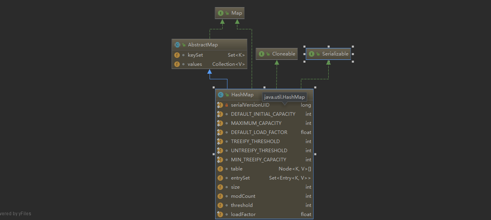

# Java集合-08HashMap源码解析及使用实例

## HashMap 简介
> HahMap是基于hash表的Map接口实现。该实现提供所有可选的映射操作，且允许key和value为null。同时
它不是线程安全以及不能保证有序。初始容量(initial capacity)和加载因子(initial capacity)是影响
HashMap的两个因素。容量表示hash表中桶(buckets)的数量，初始容量就是表示hash表在创建时候容量大小。
加载因子就是hash表在其容量自动增加时候被允许填满程度的指标。当hash表中条目数超过当前hash表容量
与加载因子的乘积时候，hash表将进行rehash操作(重建内部数据结构)，从而hash表的桶数目大约增长两倍。

>通常加载因子为0.75，这个值是时间和空间消耗的一个平衡值。过高的值降低了空间消耗但是却增加了查询成本。
在设置初始化容量时候需要考虑Map中的条目数和加载因子，以便减少rehash操作。如果初始容量的值大于最大条目数除以加载因子，
将不会发生rehash操作。

>如果你要使用HashMap存储映射关系时候，有一个充足的容量是比让HashMap自动rehash来增加容量更加有效率。需要提醒的是
使用具有相同的hashCode()的键是会降低hash表的表现。为了避免hash碰撞，键如果是Comparable的话，对解开结有一定的帮助。

>因为HashMap不是线程安全的，在多线程并发编程时候，如果有至少一个线程在对HashMap结构修改(结构修改指的是添加
或者减少映射关系，对于原来有的一个映射改变它的值不是结构上的修改)，必须保证同步化操作。通常来说使用某一对象加锁，
如果没有这么一个对象的话，该HashMap需要用Collections#synchronizedMap对其重新包裹

## HashMap 构造函数
1. public HashMap()
    > 定义一个初始容量为16，加载因子为0.75的HashMap
2. public HashMap(int initialCapacity)
    > 定义一个指定初始容量，加载因子为0.75的HashMap
3. public HashMap(int initialCapacity, float loadFactor)
    > 定义一个指定初始容量和加载因子的HashMap
4. public HashMap(Map<? extends K, ? extends V> m)
    >定义一个初始容量为不小于(m.size()/0.75+1)的2的最小指数，加载因子为0.75,包含了m中映射关系的HashMap

## HashMap 结构图


- table
    >用于存储数据
- entrySet
    > entrySet()方法的缓存值
- size
    > map中映射个数
- modCount
    > [fail-fast](https://github.com/Jzedy/Z-books/blob/master/src/main/doc/baseJava/collections/Java%E9%9B%86%E5%90%88-05fail-fast(%E5%BF%AB%E9%80%9F%E5%A4%B1%E8%B4%A5)%E6%9C%BA%E5%88%B6%E5%8E%9F%E7%90%86%E5%8F%8A%E8%A7%A3%E5%86%B3%E6%96%B9%E6%B3%95.md)判断使用
- threshold
    > resize操作的阙值，大小为capacity * load factor
- loadFactor
    >加载因子

## HashMap 源码分析
- Node
    - hash表中每个节点存储对象
```java
static class Node<K,V> implements Map.Entry<K,V>{
    final int hash;
    final K key;
    V value;
    Node<K,V> next;

    Node(int hash, K key, V value, Node<K,V> next) {
        this.hash = hash;
        this.key = key;
        this.value = value;
        this.next = next;
    }
    //省略set、get等方法
}
```
- 添加方法
```
public V put(K key, V value) {
    return putVal(hash(key), key, value, false, true);
}

static final int hash(Object key) {//hash函数，用于索引定位
    int h;
    return (key == null) ? 0 : (h = key.hashCode()) ^ (h >>> 16);
}

final V putVal(int hash, K key, V value, boolean onlyIfAbsent,
                   boolean evict) {
    Node<K,V>[] tab; Node<K,V> p; int n, i;
    if ((tab = table) == null || (n = tab.length) == 0)
        n = (tab = resize()).length;//存储数据Node没有初始化，此时初始化
    if ((p = tab[i = (n - 1) & hash]) == null)//(n-1)&hash用于定位，若为null，表明Node数组该位置没有Node对象，即没有碰撞
        tab[i] = newNode(hash, key, value, null);//对应位置添加Node对象
    else {//表明对应位置是有Node对象的，hash碰撞了
        Node<K,V> e; K k;
        if (p.hash == hash &&
            ((k = p.key) == key || (key != null && key.equals(k))))//碰撞了，且桶中第一个节点就匹配
            e = p;//记录第一个节点
        else if (p instanceof TreeNode)//碰撞了，第一个节点没有匹配上，且桶为红黑树结构，调用红黑树结构方法添加映射
            e = ((TreeNode<K,V>)p).putTreeVal(this, tab, hash, key, value);
        else {//碰撞了 不为红黑树结构，那么是链表结构
            for (int binCount = 0; ; ++binCount) {
                if ((e = p.next) == null) {//如果到了链表尾端
                    p.next = newNode(hash, key, value, null);//链尾添加映射
                    if (binCount >= TREEIFY_THRESHOLD - 1) // -1 for 1st//链表长度大于TREEIFY_THRESHOLD值，转换为红黑树结构
                        treeifyBin(tab, hash);
                    break;
                }
                if (e.hash == hash &&
                    ((k = e.key) == key || (key != null && key.equals(k))))//如果找到重复的key，判断该节点和要插入的元素key是否相等，如果相等，出循环
                    break;
                p = e;//为了遍历，和e = p.next结合来遍历
            }
        }
        if (e != null) { // existing mapping for key//key映射的节点不为空
            V oldValue = e.value;//取出节点值记录为老的节点值
            if (!onlyIfAbsent || oldValue == null)//如果onlyIfAbsent为false，或者老的节点值为null，赋予新的值
                e.value = value;
            afterNodeAccess(e);//访问后回调
            return oldValue;
        }
    }
    ++modCount;//结构性修改记录
    if (++size > threshold)//判断是否需要扩容
        resize();
    afterNodeInsertion(evict);//插入后回调
    return null;
}
```
- get方法
```
public V get(Object key) {
    Node<K,V> e;
    return (e = getNode(hash(key), key)) == null ? null : e.value;
}

final Node<K,V> getNode(int hash, Object key) {
    Node<K,V>[] tab; Node<K,V> first, e; int n; K k;
    if ((tab = table) != null && (n = tab.length) > 0 &&
        (first = tab[(n - 1) & hash]) != null) {//hash表存在且长度大于0且对应的key定位的桶不为null
        if (first.hash == hash && // always check first node
            ((k = first.key) == key || (key != null && key.equals(k))))
            return first;//第一个节点符合 返回第一个
        if ((e = first.next) != null) {//第一个不符合，如果链表还有下一个节点 
            if (first instanceof TreeNode)//为红黑树结构
                return ((TreeNode<K,V>)first).getTreeNode(hash, key);//按照红黑树结构查找
            do {//遍历链表，查询hash 和equals相等的，有则返回，一直到链尾
                if (e.hash == hash &&
                    ((k = e.key) == key || (key != null && key.equals(k))))
                    return e;
            } while ((e = e.next) != null);
        }
    }
    return null;
}

```
