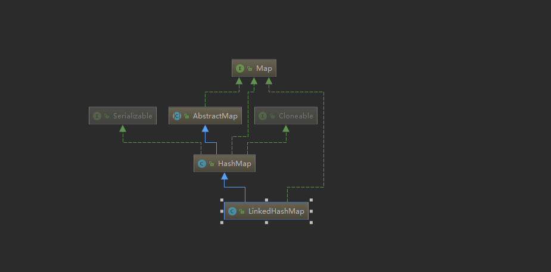

# Java集合-09LinkedHashMap源码解析及使用实例

## LinkedHashMap 简介
> hash表和链表实现了map接口，迭代顺序是可以预测的。LinkedHashMap和HashMap的不同是它所有的entry
维持了一个双向链表结构。该链表定义了通常迭代顺序是键插入的顺序。

## LinkedHashMap 定义
public class LinkedHashMap<K,V> extends HashMap<K,V> implements Map<K,V>
> 继承HashMap类，表明对于HashMap的操作LinkedHashMap都支持

## LinkedHashMap 结构图


>属性解析
- transient LinkedHashMap.Entry<K,V> head;//链表头部
- transient LinkedHashMap.Entry<K,V> tail;//链表尾部
- final boolean accessOrder;//标明LinkedHashMap迭代顺序：true代表按照最近使用排序，false表示按照插入顺序排序

## LinkedHashMap 构造函数
1. public LinkedHashMap()
    > 创建一个初始容量为16，加载因子为0.75，按照插入顺序迭代的Map
2. public LinkedHashMap(int initialCapacity)
    > 创建一个初始容量为initialCapacity大小，加载因子为0.75，按照插入顺序迭代的Map
3. public LinkedHashMap(int initialCapacity, float loadFactor)
    > 创建一个初始容量为initialCapacity大小，加载因子为loadFactor，按照插入顺序迭代的Map
4. public LinkedHashMap(Map<? extends K, ? extends V> m)
    >创建一个加载因子为0.75，包含m的键值对的Map
5. public LinkedHashMap(int initialCapacity,float loadFactor,boolean accessOrder)
    >创建一个初始容量为16，加载因子为0.75，accessOrder为true时为使用按照最近使用顺序迭代，false为插入顺序迭代的Map

## LinkedHashMap 源码分析

- Entry
```
static class Entry<K,V> extends HashMap.Node<K,V> {
    Entry<K,V> before, after;
    Entry(int hash, K key, V value, Node<K,V> next) {
        super(hash, key, value, next);
    }
}
```
> LinkedHashMap较于HashMap中Entry多了两个属性，before和after，从而维护了一个双向链表，
同时类中的head和tail分别指向链表的头部和尾部

- put 
> LinkedHashMap没有重写HashMap中的put方法。但是重写了构建新节点的newNode()方法，该方法会在
HashMap的putVal()中调用
```
Node<K,V> newNode(int hash, K key, V value, Node<K,V> e) {
    LinkedHashMap.Entry<K,V> p =
        new LinkedHashMap.Entry<K,V>(hash, key, value, e);
    linkNodeLast(p);
    return p;
}
```
```
private void linkNodeLast(LinkedHashMap.Entry<K,V> p) {//p添加到双向链表的尾部
    LinkedHashMap.Entry<K,V> last = tail;
    tail = p;//链表最后一个节点指向新增的Entry
    if (last == null)//如果原来链表最后一个节点为null，表明双向链表为空
        head = p;//双向链表的头节点指向新增节点p
    else {//表明原链表不为空
        p.before = last;//p的前一个节点指向原链表最后一个节点
        last.after = p;//原最后一个节点的后一节点指向p
    }
}
```

> 同时LinkedHashMap重写了HashMap中void afterNodeAccess(Node<K,V> p) { }和void afterNodeInsertion(boolean evict) { }方法
```
void afterNodeAccess(Node<K,V> e) { // move node to last
    LinkedHashMap.Entry<K,V> last;
    if (accessOrder && (last = tail) != e) {//对于accessOrder为true时候，将该Node移动到链表的最后位置，保证了遍历时候按照访问顺序迭代
        LinkedHashMap.Entry<K,V> p =
            (LinkedHashMap.Entry<K,V>)e, b = p.before, a = p.after;
        p.after = null;
        if (b == null)
            head = a;
        else
            b.after = a;
        if (a != null)
            a.before = b;
        else
            last = b;
        if (last == null)
            head = p;
        else {
            p.before = last;
            last.after = p;
        }
        tail = p;
        ++modCount;
    }
}
```

```
//需要说明的是这个方法中removeEldestEntry方法在LinkedHashMap是返回false的，故对于后续操作
//没有意义，通常构建一个LruCache会在达到Cache的上限是返回true
void afterNodeInsertion(boolean evict) { // possibly remove eldest
    LinkedHashMap.Entry<K,V> first;
    if (evict && (first = head) != null && removeEldestEntry(first)) {
        K key = first.key;
        removeNode(hash(key), key, null, false, true);
    }
}

protected boolean removeEldestEntry(Map.Entry<K,V> eldest) {
    return false;
}
```

- remove
> LinkedHashMap中也没有重写remove方法，但是重写了HashMap中空方法void afterNodeRemoval(Node<K,V> p) { }
```
//删除节点e时，删除链表中节点e
void afterNodeRemoval(Node<K,V> e) { // unlink
    LinkedHashMap.Entry<K,V> p =
        (LinkedHashMap.Entry<K,V>)e, b = p.before, a = p.after;
    p.before = p.after = null;
    if (b == null)
        head = a;
    else
        b.after = a;
    if (a == null)
        tail = b;
    else
        a.before = b;
}
```

- get
> LinkedHashMap中重写了get方法
```
public V get(Object key) {
    Node<K,V> e;
    if ((e = getNode(hash(key), key)) == null)//查询时候使用HashMap的getNode方法
        return null;
    if (accessOrder)//如果accessOrder为true，调整链表中对应节点位置，保证遍历时候按照访问时间顺序迭代
        afterNodeAccess(e);
    return e.value;
}
```

- 遍历
> LinkedHashMap重写了entrySet方法
```
public Set<Map.Entry<K,V>> entrySet() {
    Set<Map.Entry<K,V>> es;
    return (es = entrySet) == null ? (entrySet = new LinkedEntrySet()) : es;
}

final class LinkedEntrySet extends AbstractSet<Map.Entry<K,V>>{
//省略部分代码
    public final Iterator<Map.Entry<K,V>> iterator() {
            return new LinkedEntryIterator();
        }
}

final class LinkedEntryIterator extends LinkedHashIterator
    implements Iterator<Map.Entry<K,V>> {
    public final Map.Entry<K,V> next() { return nextNode(); }
}

abstract class LinkedHashIterator {
    LinkedHashMap.Entry<K,V> next;
    LinkedHashMap.Entry<K,V> current;
    int expectedModCount;

    LinkedHashIterator() {
        next = head;
        expectedModCount = modCount;
        current = null;
    }

    public final boolean hasNext() {
        return next != null;
    }

    final LinkedHashMap.Entry<K,V> nextNode() {
        LinkedHashMap.Entry<K,V> e = next;
        if (modCount != expectedModCount)
            throw new ConcurrentModificationException();
        if (e == null)
            throw new NoSuchElementException();
        current = e;
        next = e.after;
        return e;
    }

    public final void remove() {
        Node<K,V> p = current;
        if (p == null)
            throw new IllegalStateException();
        if (modCount != expectedModCount)
            throw new ConcurrentModificationException();
        current = null;
        K key = p.key;
        removeNode(hash(key), key, null, false, false);
        expectedModCount = modCount;
    }
}
```
> 最终可以看出迭代时候从**内部维护的双向链表的表头开始遍历**，同时双向链表的顺序在
**LinkedHashMap的增、删、改、查时候都会维护，保证了遍历时候按照插入顺序或者访问时间顺序迭代**
