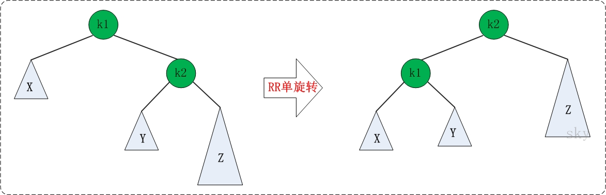
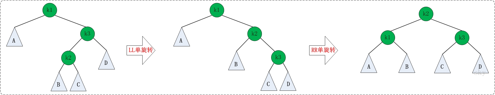

# 数据结构--(AVL)平衡二叉树
>AVL树本质上还是二叉树，但是比二叉搜索树多了一个条件：每个节点的左右子树高度不超过1
因为二叉搜索树在极端情况下无限趋近于链表，这种情况下不能体现二叉搜索树的高效率。如下图


## AVL树定义及节点定义
```java
public class AVLTree<T extends Comparable<T>>{
    private Node<T> root;
    
    class Node<T>{
        private T key;
        private Node<T> left;
        private Node<T> right;


        public Node(T key) {
            this.key = key;
        }
    }
}
```


## 树的高度
```
public int height(){
    return height(root);
}

private int height(Node<T> tree) {
    if (tree == null) return 0;
    else {
        return Math.max(height(tree.left),height(tree.right))+1;
    }
}
```

## 旋转
>AVL树在添加或者删除后，可能导致AVL树失去平衡。
失去平衡包括四种：LL(左左)，LR(左右)，RR(右右)，RL(右左),具体参考下图


### LL旋转及代码

>旋转方式：将k1变成根节点，k2变成k1的右子树，"k1的右子树"变成"k2的左子树"

```
/**
* 左左旋转
* @param tree
* @return
*/
private Node<T> llRotation(Node<T> tree){
 Node<T> lTree = tree.left;
 tree.left = lTree.right;
 lTree.right = tree;
 return lTree;
}
```
### RR旋转及代码

>旋转方式：旋转方式与LL旋转类似

```
/**
 * 右右旋转
 * @param tree
 * @return
 */
private Node<T> rrRotation(Node<T> tree){
    Node<T> rTree = tree.right;
    tree.right = rTree.left;
    rTree.left = tree;
    return rTree;
}
```

### LR旋转及代码

>旋转方式：左右旋转需要经过两次调整，第一次旋转是围绕"k1"进行的"RR旋转"，第二次是围绕"k3"进行的"LL旋转"

```
/**
 * 左右旋转
 * @param tree
 * @return
 */
private Node<T> lrRotation(Node<T> tree){
    rrRotation(tree.left);
    return llRotation(tree);
}
```

### RL旋转及代码

>旋转方式：右左旋转同样需要经过两次调整，第一次旋转是围绕"k3"进行的"LL旋转"，第二次是围绕"k1"进行的"RR旋转"

```
/**
 * 右右旋转
 * @param tree
 * @return
 */
private Node<T> rlRotation(Node<T> tree){
    llRotation(tree.right);
    return rrRotation(tree);
}
```

## 插入元素
```
public void add(T key){
    if (root == null){
        root = new Node<>(key);
    }else {
        add(root,key);//插入元素
        root = fixAfterOperation(root);//插入元素后如果失去平衡则旋转
    }
}

private Node<T> add(Node<T> tree, T key) {
    int tmp;
    if (tree == null){
        tree = new Node<>(key);
    }else {
        tmp = key.compareTo(tree.key);
        if (tmp < 0){
            tree.left = add(tree.left,key);
        }else if (tmp > 0){
            tree.right = add(tree.right,key);
        }else {
            return tree;
        }
    }
    return tree;
}

```

## 调整代码
> 当树添加或者删除某一节点后，如果导致AVL树失衡，旋转树

```
private Node<T> fixAfterOperation(Node<T> tree) {
    if (tree != null) {
        if (height(tree.left) - height(tree.right) == 2) {//如果左子树高度比右子树高度 高2，需要旋转
            if (height(tree.left.left) > height(tree.left.right)) {//如果左子树的左子树比左子树的右子树高
                tree = llRotation(tree);//左左旋转
            } else {//如果左子树的左子树比左子树的右子树低
                tree = lrRotation(tree);//左右旋转
            }

        }

        if (height(tree.right) - height(tree.left) == 2) {//如果右子树高度比左子树高度 高2，需要旋转
            if (height(tree.right.left) > height(tree.right.right)) {//如果右子树的左子树比右子树的右子树高
                tree = rlRotation(tree);//右左旋转
            } else {
                tree =rrRotation(tree);//右右旋转
            }
        }
    }
    return tree;
}
```

## 删除元素

```
public void remove(T key){
    if (root != null && key != null){
        remove(root,key);
        root = fixAfterOperation(root);
    }
}

private Node<T> remove(Node<T> tree, T key) {
    if (tree == null || key == null) return tree;
    int tmp = key.compareTo(tree.key);
    if (tmp < 0){
        tree.left = remove(tree.left,key);
    }else if (tmp > 0){
        tree.right = remove(tree.right,key);
    }else {
            Node<T> successor = successor(tree);//获取后继节点
            if (successor == null){//若后继节点为空，则删除节点的右子树为空
                Node<T> l = tree.left;//查看左子树
                if (l == null){//左子树为空，当前节点没有子节点
                    tree = null;
                }else {//左子树不为空，当前节点值置为左子节点的值，然后删除左子树刚才替换节点值
                    tree.key = l.key;
                    tree.left = remove(tree.left,l.key);
                }
            }else {//后继节点不为空，则删除节点的值置为后继节点的值，然后在删除节点的右子树删除后继节点的值
                tree.key = successor.key;
                tree.right = remove(tree.right,successor.key);
            }
    }
    return tree;
}

//获取后继节点
private Node<T> successor(Node<T> tree) {
    Node<T> result = tree.right;
    while (result != null && result.left != null){
        result = result.left;
    }
    return result;
}

```
## 参考
[后继节点](https://github.com/Jzedy/Z-books/blob/master/src/main/doc/baseJava/dataStructure/%E6%95%B0%E6%8D%AE%E7%BB%93%E6%9E%84-%E4%BA%8C%E5%8F%89%E6%90%9C%E7%B4%A2%E6%A0%91.md)参考
[完整代码](https://github.com/Jzedy/Z-books/blob/master/src/main/java/tree/avl/AVLTree.java)参考


