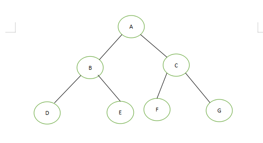
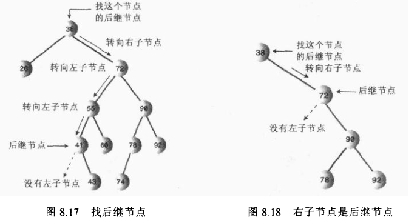
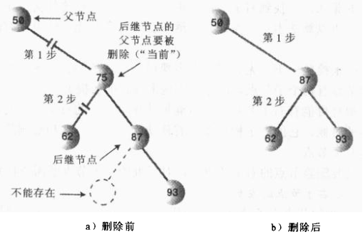
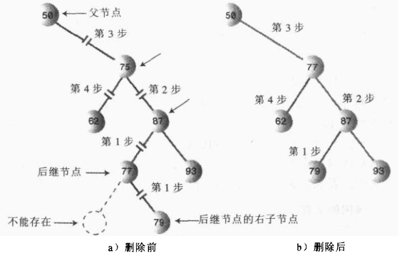

# 数据结构--树
> 对于数组，查找速度快，而添加和删除速度慢；链表，查找速度慢，而添加和删除速度快；树具备查找、增删速度快的特点

## 树的常用术语

- **路径**：从一个节点到另一个节点，所经过的节点的顺序排列称为'路径’
- **根**：树顶端的节点称为根。一棵树只有一个根，如果要把一个节点和边的集合称为树，那么从根到其他任何一个节点都必须有且只有一条路径
- **父节点**：若一个节点含有子节点，则这个节点称为其子节点的父节点
- **子节点**：一个节点含有的子树的根节点称为该节点的子节点
- **兄弟节点**：具有相同父节点的节点互称为兄弟节点
- **叶节点**：没有子节点的节点称为叶节点，也叫叶子节点
- **子树**：每个节点都可以作为子树的根，它和它所有的子节点、子节点的子节点等都包含在子树中
- **节点的层次**：从根开始定义，根为第一层，根的子节点为第二层，以此类推
- **深度**：对于任意节点n,n的深度为从根到n的唯一路径长，根的深度为0
- **高度**：对于任意节点n,n的高度为从n到一片树叶的最长路径长，所有树叶的高度为0

## 二叉树
> 树的每个节点最多只能有两个子节点

## 二叉搜索树
> 若它的左子树不空，则左子树上所有结点的值均小于它的根结点的值； 若它的右子树不空，则右子树上所有结点的值均大于它的根结点的值； 它的左、右子树也分别为二叉排序树

### 二叉树的节点类
```java
public class Node {
    private int data;//节点保存数据
    private Node leftChild;//左节点
    private Node rightChild;//右节点


    public Node(int data) {
        this.data = data;
    }

    public void display(){
        System.out.println(data);
    }

    public int getData() {
        return data;
    }

    public void setData(int data) {
        this.data = data;
    }

    public Node getLeftChild() {
        return leftChild;
    }

    public void setLeftChild(Node leftChild) {
        this.leftChild = leftChild;
    }

    public Node getRightChild() {
        return rightChild;
    }

    public void setRightChild(Node rightChild) {
        this.rightChild = rightChild;
    }
}
```

###二叉树方法
```java
public interface Tree {
    /**
     * 查找节点
     * @param data
     * @return
     */
    Node find(int data);

    /**
     * 插入节点
     * @param data
     * @return
     */
    boolean insert(int data);

    /**
     * 删除节点
     * @param key
     * @return
     */
    boolean delete(int key);

    /**
     * 中序遍历  左子树-》根节点-》右子树
     * @param current
     */
    void inOrder(Node current);

    /**
     * 前序遍历：根节点-》左子树-》右子树
     * @param current
     */
    void preOrder(Node current);

    /**
     * 后序遍历：左子树-》右子树-》根节点
     * @param current
     */
    void postOrder(Node current);

    /**
     * 查找最大值节点
     * @return
     */
    Node findMax();

    /**
     * 查找最小值节点
     * @return
     */
    Node findMin();
}
```

### 二叉搜索树实现

#### 查找方法
>查找时候，从根节点开始遍历

1. 需要查找的值比当前节点值大，搜索右子树
2. 需要查找的值等于当前节点的值，停止搜索，返回当前节点
3. 需要查找的值比当前节点值小，搜索左子树

```
public Node find(int key) {
    Node current = root;
    if (current == null) return null;
    while (current != null){
        if (current.getData()>key){
            current = current.getLeftChild();
        }else if (current.getData() < key){
            current =  current.getRightChild();
        }else return current;
    }
    return null;
}
```
#### 插入方法
>插入值时候，先确定需要插入的位置。先与根节点比较，如果值大于根节点的值，则与右子树比较，反之亦然
``` 
public boolean insert(int data) {
    Node newNode = new Node(data);
    if (root == null){
        root = newNode;
        return true;
    }else {
        Node current = root;
        Node parentNode = null;
        while (current != null){
            parentNode = current;
            if (current.getData() > data){//如果插入值小于当前节点的值
                current = current.getLeftChild();//获取当前节点的左节点
                if (current == null){//如果为空，当前值插入该位置
                    parentNode.setLeftChild(newNode);
                    return true;
                }
            }else {
                current = current.getRightChild();
                if (current == null){
                    parentNode.setRightChild(newNode);
                    return true;
                }
            }
        }
    }
    return false;
}
```
####遍历方法
> 遍历树是按照一定的顺序访问树的每一个节点

1. **中序遍历：左子树-》根节点-》右子树**
1. **前序遍历：根节点-》左子树-》右子树**
1. **后序遍历：左子树-》右子树-》根节点**


    
    中序遍历：DBEAFCG
    前序遍历：ABDECFG
    后序遍历：DEBFGCA
 
 ```
 @Override
 public void inOrder(Node current) {
     if (current != null){
         inOrder(current.getLeftChild());
         System.out.print(current.getData());
         inOrder(current.getRightChild());
     }
 }

 @Override
 public void preOrder(Node current) {
     if (current!= null){
         System.out.print(current.getData());
         preOrder(current.getLeftChild());
         preOrder(current.getRightChild());
     }
 }

 @Override
 public void postOrder(Node current) {
     if (current!= null){
         postOrder(current.getLeftChild());
         postOrder(current.getRightChild());
         System.out.print(current.getData());
     }
 }
```

#### 查找最大最小值方法

> 最大最小值，就是一直查询右/左节点直到右/左节点不存在，就是最大/小值

```
@Override
public Node findMax() {
    Node current = root;
    Node maxNode = root;
    while (current != null){
        maxNode = current;
        current = current.getRightChild();
    }
    return maxNode;
}

@Override
public Node findMin() {
    Node current = root;
    Node minNode = root;
    while (current != null){
        minNode = current;
        current = current.getLeftChild();
    }
    return minNode;
}
```

#### 删除方法
> 删除时候分为三种情况

        1. 删除节点不包含子节点
        2. 删除节点包含一个子节点
        3. 删除节点包含两个子节点
   
- **删除节点不包含子节点**
>> 只需改变删除节点的父节点引用该节点的值，将其指向null。要删除的节点不再引用，等待垃圾回收器回收即可

- **删除节点包含一个子节点**
>> 删除节点的父节点指向删除节点的子节点

- **删除节点包含两个子节点**

>> 对于删除节点存在两个子节点时候，删除后，两个子节点需要重新构成一个新的子树，删除节点的父节点指向新的子树，
子树的根节点为删除节点的后继节点。后继节点也就是比删除节点大的最小节点

>> 确认后续节点后，又需要考虑后续节点时候是否为删除节点的位置
- 后续节点是删除节点的右子节点

- 后续节点不是删除节点的右子节点，则必定为删除节点的右子节点的左子节点


```
public boolean delete(int key) {
    if (root == null) return false;//树为空，返回false
    Node current = root;
    Node parent = root;
    boolean isLeftChild = false;//用于判断需要删除的节点是其父节点的左/右子节点
    while (current.getData() != key){
        parent = current;
        if (key > current.getData()){
            isLeftChild = false;
            current = current.getRightChild();
        }else {
            isLeftChild = true;
            current = current.getLeftChild();
        }
        if (current == null)return false;//未找到，返回false
    }
    if (current.getRightChild() == null &&
        current.getLeftChild() == null){//需要删除的节点不包含子节点

        if (current == root){
            root = null;
        }else if (isLeftChild){
            parent.setLeftChild(null);
        }else parent.setRightChild(null);

    }else if (current.getRightChild() == null &&
              current.getLeftChild() != null){//需要删除的节点包含一个节点，且为左节点

        if (current == root){
            root = current.getLeftChild();
        }else if (isLeftChild){
            parent.setLeftChild(current.getLeftChild());
        }else parent.setRightChild(current.getLeftChild());

    }else if (current.getRightChild() != null &&
              current.getLeftChild() == null){//需要删除的节点包含一个节点，且为右节点

        if (current == root){
            root = current.getRightChild();
        }else if (isLeftChild){
            parent.setLeftChild(current.getRightChild());
        }else {
            parent.setRightChild(current.getRightChild());
        }

    }else {//需要删除的节点包含两个节点
        Node successor = geSuccessor(current);//获得后继节点
        if (current == root){
            root = successor;
        }else if (isLeftChild){
            parent.setLeftChild(successor);
        }else parent.setRightChild(successor);
        successor.setLeftChild(current.getLeftChild());
    }

    return true;
}

private Node geSuccessor(Node delNode) {
    Node successorParent = delNode;
    Node successor = delNode;
    Node current = delNode.getRightChild();
    while (current != null){
        successorParent = successor;
        successor = current;
        current = current.getLeftChild();
    }
    if (successor != delNode.getRightChild()){//后继节点不是需要删除节点的右节点,调整结构
        successorParent.setLeftChild(successor.getRightChild());
        successor.setRightChild(delNode.getRightChild());
    }
    return successor;
}
```
####完整的二叉查找树代码


