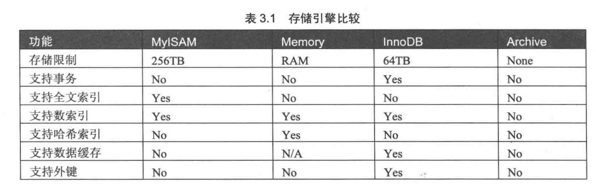

#mysql从入门到精通摘要
##SQL类型
1. 数据定义语言(DDL):DROP,CREATE,ALTER等语句
1. 数据操作语言(DML):INSERT,UPDATE,DELETE语句
1. 数据查询语言(DQL):SELECT语句
1. 数据控制语言(DCL):GRANT,REVOKE,COMMIT,ROLLBACK等语句

##MYSQL引擎
* 查看mysql引擎 ``show engines``

### InnoDB存储引擎
* Supports transactions, row-level locking, and foreign keys(支持事务，行锁和外键)
* 如果没有定义主键时候，InnoDB为每一行生成一个6B的ROWID，并以此为主键

### MyISAM存储引擎

* 基于isam的存储引擎，并对其拓展，拥有较高的插入查询速度，但是不支持事务，mysql5.5.5之前的版本中
为默认的存储引擎

###MEMORY存储引擎
* 将表中的数据存储到内存中

 >各个引擎比较 


##各种约束

###使用主键约束
     主键是表中一列或多列的组合，主键约束要求主键列的数据唯一且不能为空

> 语法规则
>> * 定义列的时候同时制定主键：字段名 数据类型 PRIMARY KEY
>> * 定义完所有列后制定主键：PRIMARY KEY(字段名称)

        例如
```sql
create table tab1(
  id int primary key ,
  name varchar 
)
```
```sql
create table tab2(
  id int ,
  name varchar ,
  primary key (id)
)
```

###使用外键约束
        外键用来在两个表的数据之间建立联系</br>
        它是表中的一个字段，可以不是本表的主键，但对应另外一个表的主键</br>
        外键的作用是保持数据的一致性、完整性，定义外键后，不允许删除另外一个表具有关联关系的行
        

> 概念知识
>> * 主表(父表)：对于两个具有关联关系的表而言，相关联字段中主键所在的那个表为主表
>> * 从表(子表): 对于两个具有关联关系的表而言，相关联字段中外键所在的那个表为从表

>数据一致性、完整性理解：创建外键时候如果子表外键字段有一个数据而父表外键字段是没有的
话是不能够创建外键成功的，必须父表外键字段也有那一个数据

```sql
create table tab1(
  id int ,
  deptId int ,
  constraint fk_dept foreign key (deptId) references dept(id)
)
```
>  * 非空约束 not null
>  * 唯一约束 Unique
>  * 默认约束 default 【默认值】
>  * 表自增 auto_increment

##查看数据表结构

### Describe
> 使用DESCRIBE 表名  或者简写 DESC 表名
### SHOW CREATE TABLE
> 使用SHOW CREATE TABLE 表名

##修改数据表
修改表指的是修改数据库已经存在的数据表的结构，MySQL使用 alter table语句修改表

###修改表名

ALTER TABLE <旧表名> RENAME [TO] <新表名>

###修改字段的数据结构
ALTER TABLE <表名> MODIFY <字段名> <数据类型>

###修改字段名
ALTER TABLE <表名> CHANGE <旧字段> <新字段> <新数据类型>

###添加字段
ALTER TABLE <表名> ADD <字段名> <数据类型> [约束条件] [first | after 已存在字段]

###删除字段
ALTER TABLE <表名> DROP <字段名>

###修改字段的排序位置
ALTER TABLE <表名> MODIFY <字段1> <字段类型> FIRST | AFTER <字段2>

###更改表的搜索引擎
ALTER TABLE <表名> ENGINE=<更改的搜索引擎>

###删除表的外键约束
ALTER TABLE <表名> DROP FORGINE KEY <外键约束名> 

###删除数据表
> 删除没有被关联的表
>> DROP TABLE [IF EXISTS] 表1,表2,...表n

>删除被其他表关联的表
>>数据表之间如果存在外键关联的情况下，如果直接删除父表是不可以的。因为直接删除，将
破环表的参照完整性。如果必须删除，可以先删除与他关联的子表，再删除父表。不过这样删除了两个表的数据，
如果需要保存子表的信息，可以先将关联的表的外键约束条件取消，再删除父表